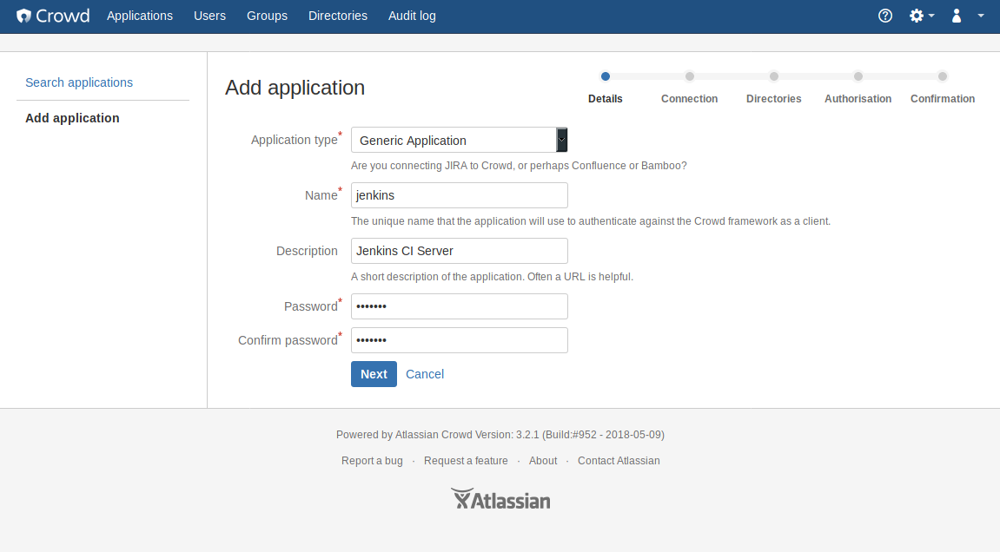
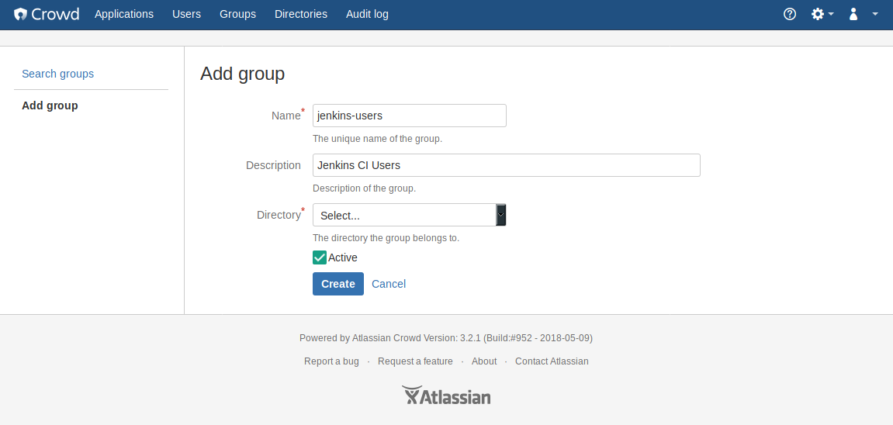
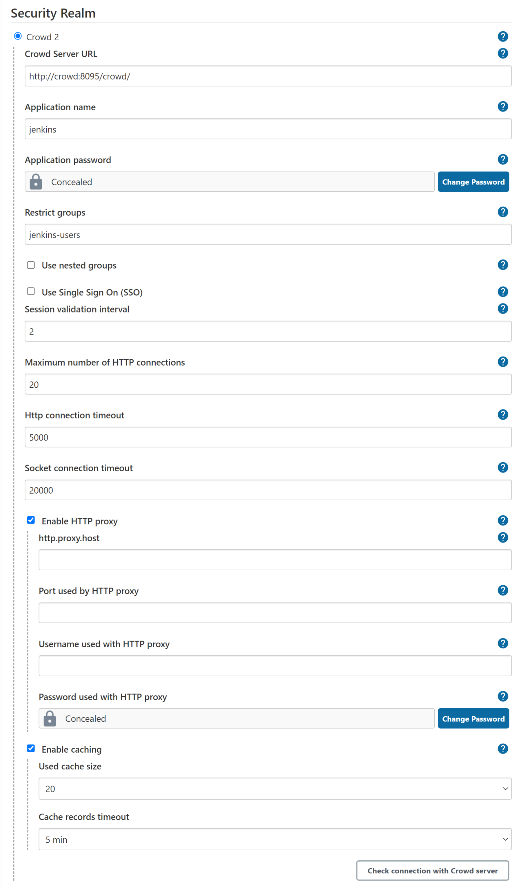

[](https://ci.jenkins.io/job/Plugins/job/crowd2-plugin/job/master/)
[](https://sonarcloud.io/dashboard?id=jenkins-crowd2-plugin)
[](https://sonarcloud.io/dashboard?id=jenkins-crowd2-plugin)
[](https://jenkins.crowdin.com/crowd2-plugin)

[](https://gitpod.io/#https://github.com/jenkinsci/crowd2-plugin)


# Crowd 2 Plugin for Jenkins (crowd2-plugin)

This plugin allows using [Atlassian Crowd](https://www.atlassian.com/software/crowd) or [JIRA](https://www.atlassian.com/software/jira) as an authentication and authorization provider for Jenkins (Crowd version 2 and later). Crowd is a commercial identity management and Single Sign-On (SSO) application.

## Requirements

Current version of plugin is tested agains `Crowd 3.7`, with `Jenkins 2.289.3`.
This plugin uses Crowd REST APIs for connecting to Crowd and therefore
requires Crowd \>= 2.1
(see <http://developer.atlassian.com/display/CROWDDEV/Crowd+REST+APIs>).
If you have an older Crowd server, use the older "Crowd Plugin" instead.

## License

This project is licensed under the MIT License - see the [LICENSE](LICENSE) file for details

## Configuration

To configure the plugin, you first need to create a new application in
Crowd. <https://confluence.atlassian.com/crowd/adding-an-application-18579591.html>
has more information on how to configure applications in Crowd.



Be sure to also allow connections to Crowd from the server Jenkins runs
on.

Next you need to configure a group that contains all users that are
allowed to login into Jenkins.
<https://confluence.atlassian.com/crowd/managing-users-and-groups-193223.html>
has more information how to manage users and groups.



Once you have the application and group configured in Crowd, you can
enable Crowd-based security in Jenkins on the "Manage Jenkins" page.
Enter the URL of your Crowd server (will typically end with .../crowd)
as well as the application name, password and group name you configured
in Crowd.



Click on the "Check Connection" button to ensure that your connection
credentials are valid.

Crowd supports nested groups, i.e. groups which contain other groups as
members and groups that are members of other groups (see
<http://confluence.atlassian.com/display/CROWD/Nested+Groups+in+Crowd>).
If you want to use this feature, click on the "Advanced..." button and
enable it. This may degrade performance, depending on your server
configuration.

This plugin doesn't support Crowd roles. As long as there's not enough
interest, it's unlikely that they are supported in a future version
because they are deprecated since Crowd 2.0 (see
[here](http://confluence.atlassian.com/display/CROWD/Crowd+2.0+Upgrade+Notes)
for details).


This plugin works well with [Matrix Authorization Strategy Plugin](https://plugins.jenkins.io/matrix-auth):
You can use Crowd users and groups to define permissions on folder/pipeline/job level.

## Development

These instructions will get you a copy of the project up and running on your local machine for development and testing purposes. See deployment for notes on how to deploy the project on a live system.

### A classic approach.

``` sh
git clone https://github.com/jenkinsci/crowd2-plugin.git
cd crowd2-plugin
mvn install

# to start the plugin in a local embedded test environment, run
mvn hpi:run
```

### Standalone Test Environment

To start a local build of the plugin in a standalone test environment, run
```
mvn install
```
then upload the resulting .hpi file (target/crowd2-VERSION.hpi) like described in the [official documentation](https://jenkins.io/doc/book/managing/plugins/#advanced-installation).

### More advanced one with docker

More about it in [CONTRIBUTING.md](CONTRIBUTING.md)
``` sh
git clone https://github.com/jenkinsci/crowd2-plugin.git
cd crowd2-plugin

# run this if you want to use mvn jenkins repo
./_init.sh

# this command will set up local crowd and jenkins instance
# with all integration already setup 
./_start.sh 11
```

### Built With

* [Jenkins](https://jenkins.io/) - Automation server
* [Maven](https://maven.apache.org/) - Dependency Management

### Versioning

We use [SemVer](http://semver.org/) for versioning (starting from version 2.0.0). For the versions available, see the [tags on this repository](https://github.com/pingunaut/crowd2-plugin/tags).

### Authors

See the list of [contributors](https://github.com/jenkinsci/crowd2-plugin/contributors) who participated in this project.


## FAQ

### Is Single-Sign-On (SSO) supported?

Yes :-) That was the main reason I wrote this plugin.

### What's the difference between this plugin and "Crowd Plugin"?

Apart from SSO this plugin contains fixes for almost all open issues of
the "Crowd Plugin". (If you look at the issue navigator, there are
actually seven; five of them are almost or even older than one year.
Looking at the source code at GitHub
(<https://github.com/jenkinsci/crowd-plugin>), there doesn't seem to be
much activity trying to fix them). I have to admit that I haven't tested
[JENKINS-9924](https://issues.jenkins-ci.org/browse/JENKINS-9924) so
far, i.e. what happens when the Crowd server is down. This will be done
in the near future.

A more technically answer is that this plugin code was written from
scratch using a different API to connect to the Crowd server, i.e. the
Crowd REST APIs. These are recommended by Atlassian for long-term
compatibility.

In contrary, the "Crowd Plugin" uses Crowd's Java integration libraries
that have the disadvantage that one perhaps has to re-compile the source
code when a new Crowd release is available and one has to update these
libraries.

### Why do I have to choose a group for users?

To restrict the number of your Crowd users that are allowed to login. I
thought it's cool to have such a feature because for example Confluence
and JIRA, other well known products from Atlassian, also work that way.

### Is there Localization support?

Yes.

If you want to add some translation please feel free to add some in 
https://crowdin.jenkins.io/crowd2-plugin
After proper review it will be automaticaly added to plugin.

## Roadmap

The following changes and improvements are planned for the following releases

### 3.x.x

* [ ] Work on the open JIRA issues
* [ ] Improve test coverage by adding new tests
* [ ] Merge open pull requests to fix caching and httpclient to solve performance and compatibility issues
* [ ] Fix logging for plugin
